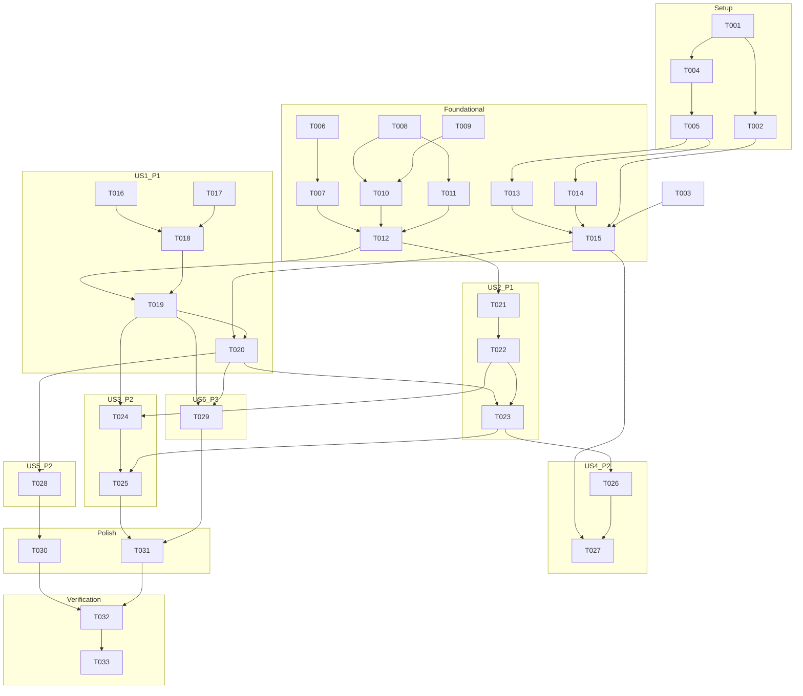

# Tasks: 手机录屏与 RTMP 直播推流（media_stream 模块化解耦）

**Input**: Design documents from `spec/media-stream/`（spec.md + plan.md）
**Prerequisites**: plan.md (required), spec.md (required for user stories)

**Tests**: 本特性未要求 TDD/自动化测试任务；验证以构建 + 部署 + 人工功能验证为准（验证范围：build-only，用户已在 Phase 3 前置门确认）。

**Organization**: 任务按用户故事分组（US1 推流 P1 / US2 录屏 P1 / US3 边推边录 P2 / US4 录制列表 P2 / US5 配置持久化 P2 / US6 自动重连 P3），共享原生层（采集/编码/引擎/NAPI 桥）置于 Foundational 阶段。

## Format: `[ID] [P?] [Story] Description`

- **[P]**: 可并行（不同文件、无未完成依赖）
- **[Story]**: 所属用户故事（仅用户故事阶段任务）
- 所有任务含精确文件路径

## Path Conventions

- 仓库根：`/Users/qshh/Desktop/Code/MediaStream/`
- 两模块工程：`entry/`（HAP，UI）与 `media_stream/`（HAR，原生+API 契约）
- 任务中的路径均相对仓库根书写；`spec/media-stream/` 为文档目录（本文件所在）
- 原生源码统一置于 `media_stream/src/main/cpp/`（域子目录 capture/codec/audio/muxer/rtmp/core/napi/common）
- entry ArkTS 源码遵循 MVVM 边界：`entry/src/main/ets/{pages,views,viewmodel,service,data,model}/`

---

## Phase 1: Setup（工程接线）

**Purpose**: 模块依赖、权限声明、模板清理与 API 契约定义

- [x] T001 配置 entry 模块依赖：`entry/oh-package.json5` 新增 `"media_stream": "file:../media_stream"`，移除 `"libentry.so"` 依赖项
- [x] T002 清理 entry 原生模板：`entry/build-profile.json5` 删除 `externalNativeOptions`；删除 `entry/src/main/cpp/`（napi_init.cpp、CMakeLists.txt、types/libentry）；重写 `entry/src/main/ets/pages/Index.ets` 为无 native 引用的最小占位页
- [x] T003 声明权限与后台模式：`entry/src/main/module.json5` 增加 `requestPermissions`（ohos.permission.INTERNET、ohos.permission.MICROPHONE、ohos.permission.KEEP_BACKGROUND_RUNNING）并在 EntryAbility 配置 `backgroundModes: ["audioRecording"]`
- [x] T004 清理并重建 media_stream 模块骨架：删除 `media_stream/src/main/ets/components/MainPage.ets`；重写 `media_stream/Index.ets` 为 API re-export；重写 `media_stream/src/main/cpp/CMakeLists.txt`（C++17、链接 plan.md 第 5 节全部能力库、逐文件列举源码）
- [x] T005 编写 media_stream API 契约：`media_stream/src/main/cpp/types/libmedia_stream/Index.d.ts`——完整定义 OutputConfig、三个状态平面、SessionStats、RecordingMeta、MediaStreamEvent 判别联合、ErrorCode 枚举及 init/startStreaming/stopStreaming/startRecording/stopRecording/onEvent/destroy 七个方法签名（对齐 plan.md Contracts 第 1/2 节）

---

## Phase 2: Foundational（共享原生层 + entry 服务骨架）

**Purpose**: 采集/编码/引擎/桥接等 US1、US2 共同依赖的阻塞性基础设施

**⚠️ CRITICAL**: 本阶段完成前不得开始用户故事任务

- [x] T006 原生公共设施：`media_stream/src/main/cpp/common/logger.h`（hilog 封装、统一 tag）与 `media_stream/src/main/cpp/common/bounded_queue.h`（有界阻塞队列模板：MP4 阻塞策略 + RTMP 丢视频帧策略两种语义）
- [x] T007 NAPI 桥与事件通道：`media_stream/src/main/cpp/napi/js_event_emitter.h/.cpp`（TSFN 封装、stats 节流合并投递）+ `media_stream/src/main/cpp/napi/napi_init.cpp`（模块注册名 media_stream、参数解析、异常映射、七个方法转发引擎单例）
- [x] T008 AVScreenCapture 采集封装：`media_stream/src/main/cpp/capture/screen_capture.h/.cpp`——原始流配置（OH_ORIGINAL_STREAM + NV12 优先/RGBA 兜底）、内录+麦克风双路 PCM 回调、OH_NativeDisplayManager 显示尺寸查询与预设短边等比缩放（偶数对齐）、系统授权拒绝/中断错误映射（参考 Harmony-OBS-Studio/plugins/ohos-capture/obs-ohos-screen-capture.c 的已验证做法）
- [x] T009 [P] 色彩转换兜底：`media_stream/src/main/cpp/capture/color_converter.h/.cpp`（RGBA→NV12 标量实现，处理 stride）
- [x] T010 视频硬件编码器：`media_stream/src/main/cpp/codec/video_encoder.h/.cpp`——OH_VideoEncoder H.264 buffer 模式（宽高/fps/码率/GOP 2s/CBR）、输入投递、输出回调提取 SPS/PPS 生成 avcC、Annex-B→AVCC 转换、错误回调上抛
- [x] T011 音频混音与编码：`media_stream/src/main/cpp/audio/audio_mixer.h/.cpp`（双路 s16 饱和混音、采样对齐、单输入直通）+ `media_stream/src/main/cpp/codec/audio_encoder.h/.cpp`（OH_AACEncoder AAC-LC 48k 双声道、ASC 提取）
- [x] T012 会话引擎（控制面核心）：`media_stream/src/main/cpp/core/media_stream_engine.h/.cpp`——capture/stream/record 三平面状态机、会话生命周期（首输出启动采集编码、末输出停止后全量释放）、FanOut 编码输出分发器、时间戳三层换算（ns→μs→ms）、配置校验（rtmp:// 前缀、预设映射）、防重入幂等、麦克风运行中无数据降级检测（micDegraded 事件）、destroy 幂等
- [x] T013 [P] entry 域类型与配置持久化：`entry/src/main/ets/model/Types.ets`（画质预设表、音频源枚举、路由名、事件类型映射）+ `entry/src/main/ets/data/PreferencesRepository.ets`（rtmpUrl/preset/audioMode 的读写）
- [x] T014 [P] entry 三个服务：`entry/src/main/ets/service/MediaStreamService.ets`（进程级单例：init(filesDir)、onEvent 订阅分发、指令转发）+ `entry/src/main/ets/service/PermissionService.ets`（MICROPHONE 检查/申请/拒绝降级决策）+ `entry/src/main/ets/service/BackgroundTaskService.ets`（MODE_AV_PLAYBACK_AND_RECORD + SUBMODE_SCREEN_RECORD_NORMAL_NOTIFICATION 申请/取消）
- [x] T015 entry 页面骨架与控制台视图模型：`entry/src/main/ets/pages/Index.ets`（Navigation 宿主 + NavPathStack）+ `entry/src/main/ets/viewmodel/ConsoleViewModel.ets`（@ObservedV2 状态镜像三平面、事件订阅、配置加载、操作编排：权限→长时任务→引擎指令）

**Checkpoint**: 基础设施就绪，US1/US2 可开始

---

## Phase 3: User Story 1 - RTMP 直播推流 (Priority: P1) 🎯 MVP

**Goal**: 用户配置 RTMP 地址后开始/停止推流，实时查看状态与统计
**Independent Test**: 局域网 RTMP 服务器（SRS/nginx-rtmp）拉流验证画面与声音，不依赖录制功能

- [x] T016 [P] [US1] AMF0 编解码子集：`media_stream/src/main/cpp/rtmp/amf.h/.cpp`（number/string/bool/object/null/eoh 编解码，满足 connect/createStream/publish/onStatus 命令所需）
- [x] T017 [P] [US1] FLV 组包器：`media_stream/src/main/cpp/rtmp/flv_packager.h/.cpp`（H.264 AVCC sequence header 与 NALU 分装、AAC ASC+原始帧、@setDataFrame onMetaData 元数据）
- [x] T018 [US1] RTMP 客户端：`media_stream/src/main/cpp/rtmp/rtmp_client.h/.cpp`——URL 解析（rtmp://host[:port]/app/stream，默认端口 1935）、非阻塞 socket 连接、simple handshake、connect/createStream/publish 命令序列与 _result/onStatus 等待、chunk size 4096 协商、发送线程 + 有界队列（满丢视频帧记 droppedVideoFrames）、指数退避重连状态机骨架（行为参考 Harmony-OBS-Studio/plugins/obs-outputs/librtmp）
- [x] T019 [US1] 引擎挂接推流链路：`media_stream/src/main/cpp/core/media_stream_engine.cpp` 完善 startStreaming/stopStreaming——采集→编码→FLV→RTMP 全链路打通、streamState 连接中/推流中/停止/错误上报、stats（sentBytes/videoFps/videoBitrateKbps/droppedVideoFrames）、RTMP_URL_INVALID/RTMP_CONNECT_FAIL/RTMP_TIMEOUT 错误路径
- [x] T020 [US1] 控制台推流交互：`entry/src/main/ets/views/ConsoleView.ets`——RTMP 地址输入（前缀实时校验）、开始/停止推流按钮态机、streamState 状态徽标、统计面板（时长/码率/帧率/已发送）、错误 AlertDialog、录屏授权拒绝引导提示、麦克风未授权降级确认弹窗（继续=仅内录 / 取消）

**Checkpoint**: US1 独立可用（配合真机 + RTMP 服务器）

---

## Phase 4: User Story 2 - 本地录屏生成 MP4 (Priority: P1) 🎯 MVP

**Goal**: 开始/停止本地录制，生成沙箱 MP4 并可查询
**Independent Test**: 无需服务器，录制文件可被系统播放器正常播放

- [x] T021 [US2] MP4 封装器：`media_stream/src/main/cpp/muxer/mp4_recorder.h/.cpp`——OH_AVMuxer MP4（AddTrack：AVC+width/height+CODEC_CONFIG(avcC)、AAC+48000/2+CODEC_CONFIG(ASC)；pts μs、SYNC_FRAME flags、独立写线程 + 阻塞队列、Stop 安全收尾写 moov、存储不足检测与安全停止、文件名 screen_yyyyMMdd_HHmmss.mp4 于 {filesDir}/videos）
- [x] T022 [US2] 引擎挂接录制链路：`media_stream/src/main/cpp/core/media_stream_engine.cpp` 完善 startRecording/stopRecording——录制复用当前会话配置、recordFinished（meta+normal/error）事件、无其他输出时联动停止采集、录制时长/大小统计
- [x] T023 [US2] 控制台录制交互与录制仓库：`entry/src/main/ets/views/ConsoleView.ets` 增加开始/停止录制按钮与录制时长显示（与推流状态并存）；新建 `entry/src/main/ets/data/RecordingsRepository.ets`（recordings.json 索引维护：新增/删除/列表、启动时孤儿文件检测标记无效）

**Checkpoint**: US1 + US2 均独立可用（MVP 完整）

---

## Phase 5: User Story 3 - 边推流边录制 (Priority: P2)

**Goal**: 同一编码流双输出，两路独立启停（双向场景）
**Independent Test**: 推流中开启录制/录制中开启推流，5 分钟双输出均正常

- [x] T024 [US3] 引擎双输出并发编排：`media_stream/src/main/cpp/core/media_stream_engine.cpp` 完善并发语义——录制中 startStreaming 复用会话参数（校验新 rtmpUrl）、推流中 startRecording 直通、任一输出独立停止不影响另一路、末路停止时资源统一收尾、双输出统计互不串扰
- [x] T025 [US3] 控制台双输出并行 UI：`entry/src/main/ets/views/ConsoleView.ets` 完善双状态并行显示（推流徽标+录制徽标同时活跃）、双向操作按钮可用性矩阵（录制中允许开始推流、推流中允许开始录制）

---

## Phase 6: User Story 4 - 录制文件列表管理 (Priority: P2)

**Goal**: 录制列表的查看/播放/删除/分享闭环
**Independent Test**: 依赖 US2 产物即可独立验证四项操作

- [x] T026 [US4] 录制列表视图：`entry/src/main/ets/views/RecordingsView.ets`——按创建时间倒序 List（文件名/时长/大小）、播放 Sheet（ArkUI Video 组件加载沙箱路径）、删除 AlertDialog 确认（文件+索引）、系统分享（ACTION_SEND_DATA + FLAG_GRANT_READ_URI_PERMISSION，失败 toast 降级）、无效残留文件标记与清理入口
- [x] T027 [US4] 列表视图模型与路由接线：`entry/src/main/ets/viewmodel/RecordingsViewModel.ets`（列表加载/删除/分享/清理操作编排）+ `entry/src/main/ets/pages/Index.ets` 注册 recordings 路由 + `entry/src/main/ets/views/ConsoleView.ets` 添加"录制列表"入口按钮

---

## Phase 7: User Story 5 - 参数配置与持久化 (Priority: P2)

**Goal**: 画质预设/音频源/RTMP 地址可配置并跨启动保留
**Independent Test**: 修改配置→杀进程重启→配置恢复；切换预设后推流分辨率/码率生效

- [x] T028 [US5] 控制台设置区闭环：`entry/src/main/ets/views/ConsoleView.ets` 增加设置区（画质预设三档选择、音频源三档切换）+ `entry/src/main/ets/viewmodel/ConsoleViewModel.ets` 完善配置加载/保存闭环（变更即持久化到 PreferencesRepository；会话进行中锁定设置并提示"下次会话生效"）

---

## Phase 8: User Story 6 - 网络中断自动重连 (Priority: P3)

**Goal**: 推流断网自动重连（≤3 次指数退避），状态可见、可手动停止
**Independent Test**: 推流中开关飞行模式，观察重连状态与恢复

- [x] T029 [US6] 重连链路完善与状态可见：`media_stream/src/main/cpp/rtmp/rtmp_client.cpp` 完善重试计数上报（streamState=reconnecting + reconnectAttempt=1/3）、手动停止取消重连、重连成功后 sequence header（AVCC/ASC/metadata）重发；`entry/src/main/ets/views/ConsoleView.ets` 展示"重连中 (n/3)"状态与停止按钮常可用

---

## Phase 9: Polish（横切关注点）

- [x] T030 [P] 错误文案与提示规范化：`entry/src/main/ets/model/Types.ets` 增加 ErrorCode→中文用户可读文案映射表，`entry/src/main/ets/views/ConsoleView.ets` 与 `entry/src/main/ets/views/RecordingsView.ets` 统一错误/降级/引导提示样式
- [x] T031 生命周期与资源释放加固：复查 `media_stream/src/main/cpp/core/media_stream_engine.cpp` 与 `entry/src/main/ets/viewmodel/ConsoleViewModel.ets`、`entry/src/main/ets/entryability/EntryAbility.ets`——destroy 幂等、重复启停/停止中再操作安全忽略、页面销毁不误停会话（后台采集预期）、长时任务与输出生命周期严格同步；清理模板残留资源（entry/media_stream 未引用的 string/float 资源条目按需保留）

---

## Phase 10: Verification

<!-- verification_scope: build-only -->

**Purpose**: 构建与部署验证（依据用户选择：仅 build + deploy，不运行 UI 遍历验证）

- [x] T032 调用 build_project 构建整个工程（default product，debug），修复所有编译/链接/ArkTS 严格模式错误，迭代直至构建成功
- [x] T033 调用 start_app 将应用部署到可用设备/模拟器，确认可安装启动

---

## 📊 Dependency Graph



## ⚡ Parallel Execution Guide

| Phase | Tasks | Required Files | Execution Notes |
|-------|-------|----------------|------------------|
| Setup | T001+T002+T003 与 T004+T005 | entry 配置 vs media_stream 配置 | 两文件域可并行；T005 契约尽早冻结 |
| Foundational | T009 与 T006/T007/T008 | color_converter 独立 | T009 与采集/桥接无耦合 |
| Foundational | T013 与 T014 | Types/Preferences vs 三服务 | T005 完成后即可并行 |
| US1 | T016 与 T017 | amf 与 flv_packager | 二者仅依赖公共设施，可并行后汇入 T018 |
| Polish | T030 与 T031 | 错误文案 vs 生命周期 | 不同文件域可并行 |

## Dependencies & Execution Order

### Phase Dependencies

- **Setup (Phase 1)**: 无外部依赖，立即可开始；T005（API 契约）是原生与 entry 两侧的共同上游
- **Foundational (Phase 2)**: 依赖 Setup（模块接线与契约）；**阻塞全部用户故事**
- **User Stories (Phase 3–8)**: 均依赖 Foundational 完成；故事间按依赖图推进（US1/US2 先行构成 MVP，US3 依赖 US1+US2，US4 依赖 US2，US5/US6 依赖 US1）
- **Polish (Phase 9)**: 依赖全部所需故事完成
- **Verification (Phase 10)**: 依赖全部前序任务

### User Story Dependencies

- **US1 (P1)**: Foundational 后即可开始，无跨故事依赖
- **US2 (P1)**: Foundational 后即可开始；与 US1 共享采集/编码层但互不依赖
- **US3 (P2)**: 依赖 US1（推流链路）+ US2（录制链路）完成
- **US4 (P2)**: 依赖 US2（录制仓库 T023）
- **US5 (P2)**: 依赖 US1（控制台视图 T020）
- **US6 (P3)**: 依赖 US1（RTMP 链路 T019 + 视图 T020）

### Within Each User Story

- 原生组件（协议/封装器）先于引擎挂接，引擎挂接先于 UI 交互
- 独立交付判据见各故事 **Independent Test**（US1 需真机+RTMP 服务器；US2 真机/模拟器均可；模拟器采集链路可能受限，以错误路径与 UI 交互验证为辅）

## Parallel Example: User Story 1

```text
# AMF0 与 FLV 组包可同时开工（不同文件、仅依赖公共设施）：
Task: T016 [P] [US1] AMF0 编解码子集 → media_stream/src/main/cpp/rtmp/amf.h/.cpp
Task: T017 [P] [US1] FLV 组包器     → media_stream/src/main/cpp/rtmp/flv_packager.h/.cpp

# 汇合后再进行：
Task: T018 [US1] RTMP 客户端（依赖 T016+T017）
Task: T019 [US1] 引擎挂接推流链路（依赖 T018 + Foundational T012）
Task: T020 [US1] 控制台推流交互（依赖 T019 + Foundational T015）
```

## Implementation Strategy

### MVP First（Setup + Foundational + US1 + US2 = T001–T023）

1. 完成 Phase 1 Setup（工程接线 + API 契约冻结）
2. 完成 Phase 2 Foundational（采集/编码/引擎/桥接 + entry 骨架）
3. 完成 Phase 3 US1（推流链路）→ 独立验证（真机 + 局域网 RTMP 服务器拉流）
4. 完成 Phase 4 US2（录制链路）→ 独立验证（MP4 可播放）
5. **STOP and VALIDATE**: MVP 交付"录屏 + 推直播流"双核心能力

### Incremental Delivery

1. Setup + Foundational → 基础设施就绪
2. +US1 → 推流可用（MVP 半程）
3. +US2 → 录制可用（MVP 完整）
4. +US3 → 边推边录；+US4 → 录制列表闭环；+US5 → 配置持久化；+US6 → 断线重连
5. Polish → 错误文案/生命周期加固；Verification → 构建 + 部署

### Summary（任务统计）

- **总任务数**: 33（Setup 5 / Foundational 10 / US1 5 / US2 3 / US3 2 / US4 2 / US5 1 / US6 1 / Polish 2 / Verification 2）
- **按故事**: US1=5、US2=3、US3=2、US4=2、US5=1、US6=1（其余为共享基建与横切）
- **并行机会**: 见 ⚡ Parallel Execution Guide（5 组）
- **建议 MVP 范围**: T001–T023

## Notes

- [P] 任务 = 不同文件且无未完成依赖
- [Story] 标签将任务映射回 spec.md 用户故事，保证可追溯
- 每个用户故事可独立完成与验证；阶段间严格按依赖图执行
- 任务粒度面向 LLM 子代理直接执行：描述含精确文件路径与验收要点
- 原生参考代码：采集层参考 `Harmony-OBS-Studio/plugins/ohos-capture/obs-ohos-screen-capture.c`；RTMP 行为参考 `Harmony-OBS-Studio/plugins/obs-outputs/librtmp/`（仅参考，不复制链接 OBS 运行时）
- 验证环境前提（非任务范围）：真机推流验证需自备局域网 RTMP 服务器；根工程 signingConfigs 为空属环境配置，验证子代理按需处理
